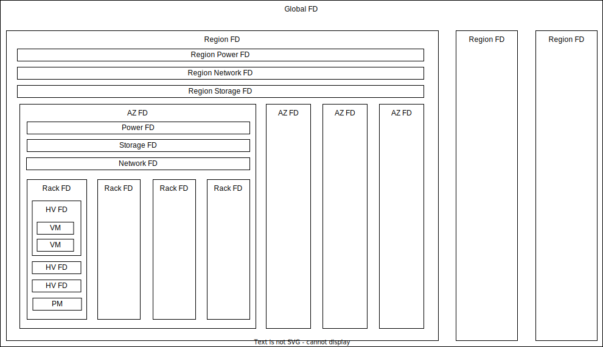

## アーキテクチャとは？

アーキテクチャとは、なんらかのシステムを開発する上で、その設計の元ととなる構造や構成の概念のことです。

一般的なシステム開発は以下の流れで行います。

1. （関係者全員で）要件や設計哲学（アーキテクチャよりもさらに抽象的なこと）を定義する
2. （少人数で）アーキテクチャ設計
3. （少人数で）プロトタイプ実装
4. 本設計、本実装
5. （ベータ）リリース

上記のうち、1, 2, 3の過程は並行で行うこともよくあります。  
要件やアーキテクチャベースですべての実装ができる場合もありますが、実際に何ができるか検証してからでないと要件やアーキテクチャが決められない場合もあります。  
この場合は、事前に検証などしたうえで、できることベースで、要件やアーキテクチャが変わることもあり、柔軟に対応することが求められます。

1 の要件定義は、基本的に関係者全員で行い、なるべく抜け漏れがないように定義します。  
アーキテクチャ設計やプロトタイプ実装も並行する可能性が高いので、影響の大きいものは早めに具体化していきましょう。  
また、完成したシステムが関係者に受け入れられるように設計哲学に関しても共有しておきます。

2 のアーキテクチャ設計は、要件定義がある程度そろったら進めて問題ないです。  
アーキテクチャ設計のやり方は、全体をカバーするような設計のたたき台を（各人一個づつなどで）複数人で複数作り、それを元に具体化します。    
簡単なものなら一人で設計をして、たたき台が一案だけでも問題ありません。  
もしアーキテクチャ設計をたたき台なしにやろうとすると、設計関係者の思惑を把握するのが難しく、それらを都合よく取り入れていくと設計が破綻しかねないので、最初に各人のある程度完成された設計を出し切ってもらったほうが良いと思います。

3 のプロトタイプ実装は、検証系はある程度分割がしやすいので多人数でやっても問題ありません。  
しかし、プログラムのベースの実装は少人数（一人でもよい）でやったほうがよいです。  
プロトタイプ実装は、書き直しが多く発生するため多人数で協調して開発するのが難しいです。

4 の本設計、本実装は、ある程度の意思統一ができてる段階なので、多人数でやっても問題ありません。もちろん少人数でもよいです。  
この段階で新規に開発に加わるメンバーもいるので、この段階までに新規参入できるようドキュメントなどはしっかり用意しておきましょう。  
初期開発者による属人化はやめましょう。

5 のリリースは、よしなに。  
基本的にベータリリースで数ヵ月から1年運用して、改修などをして、その後本リリースという流れになります。  
要件すべてのものを完璧に実装しないとリリースできないわけではありません。  
リリースまでに最低限の機能は実装し、その後拡張できるようにしましょう。  

## アーキテクチャの考え方

アーキテクチャは以下のようなことを多角的に考える必要がある。

- 要件・機能の実現方法
  - なるべくユーザファーストで考えることが重要です
    - 自分たちが作りたいもの、自分たちに都合のよいものではなく、ユーザが求めるものを作りましょう
    - 実際の利用ケースを想定しましょう
    - 実装はシンプルにすべきだが、こちらの実装がシンプルになるからと言って、むやみにユーザに複雑性を押し付けてはいけません
  - パフォーマンスの考慮
    - レイテンシや計算コストが低いなどのパフォーマンスがいいことは良いことです
    - しかしパフォーマンスを求めるがあまり、複雑になってメンテナンス性が落ちる場合は、ほどほどにしてください
      - データプレーンではなるべくパフォーマンスを重視すべきですが、メンテナンス性が悪化するとそれはそれでコストが増えます
    - データプレーンにおいてハードウェアに頼った実装はケースバイケースなので慎重に検討してください
      - 大多数が利用しているようなハードウェア支援機構は積極的に活用すべきです
        - ソフトウェア実装よりもハードウェア実装のほうが圧倒的にパフォーマンスが高く、コストも安く済む場合が多いです
        - それでもハードウェアのバグはつきものなので、バグがあったらベンダーと協調して直していきましょう
      - ハードウェア自体の独自実装や、FPGAなどを使ったプログラマブルなハードウェアの利用はなるべく避けましょう
        - ハードウェアベンダへの依存はもちろんですが、社内開発であってもその開発者に依存する可能性が高くそれもリスクです
        - ハードウェアに依存するとリードタイムも長くなり、機能追加やバグ修正も大変です
        - もちろんハードウェアだからこそ実現できることもありますが、それが必要なケースは稀なので慎重に検討してください
- プログラムに落とし込めるかを意識する
  - 最終的にはプログラムに落とし組む必要があるので、プログラムに落とし込んだ場合もイメージして設計する
  - レイヤーを分けて書けそうか？
    - 各レイヤー間はインターフェイスでつなげて、各レイヤーごとでunittestを完結できるようにする
  - 循環参照はもってのほかで、レイヤー間の依存は一方向にする
- コントロールプレーンの運用性、メンテにおける障害体制
  - コントローラはなるべく無停止メンテができるようにしましょう
  - SLAに影響せずにメンテをできるようにしましょう
    - メンテが稼働率などに影響しないようにSLAを設定しましょう
    - DBのマイグレーションなどでどうして止めないといけないメンテも想定しましょう
      - メンテで最大限で止めてもよい範囲を決めましょう
      - 大規模メンテ時にGlobal単位で止めてよいか？Region単位で止めてよいか？AZ単位で止めてよいか？
      - このようなメンテは基本的に数年に一度程度なのでサービスによりますがGlobalで止めてよい場合が多いです
  - コントローラの影響範囲を一定以下にしましょう
    - データプレーンに関わるコントローラはなるべくAZに閉じましょう
      - コントローラをAZに閉じて配置するのではなく、コントローラの影響範囲をAZに閉じることに注意
      - コントローラ自体は複数AZに配置して冗長化し、1AZが落ちても利用できるようにしましょう
    - AZやRegionをたばねてリソース管理する必要のあるコントローラも場合によってはあります
- コントロールプレーンのキャパプラ・スケーラビリティ
  - 一つのコントローラが管理すべきリソース量や計算量を意識しましょう
  - コントローラは階層的にスケールさせることが多いです
  - コントローラのスケーラビリティ問題の主要因はDBです
    - 特にDBの書き込みがスケールアウトできないのでうまくシャーディングして管理できるようにしましょう
- コントロールプレーンの物理障害耐性
  - 基本的にサービスをRegion分散、AZ分散するだけなので、アーキテクチャに影響することは少ないです
  - 最低限AZで落ちても大丈夫なようにサービス配置しましょう
  - 重要度によってはRegionで落ちても大丈夫なようにサービス配置しましょう
- データプレーンのキャパプラ・スケーラビリティ
  - 基本的にサーバを並べるだけでスケールできるようにしましょう
  - ものによってはキャパプラなどして、１台当たりのリソース量を考慮する必要もありますが、アーキテクチャに影響することは少ないです
- データプレーンの物理障害耐性
  - 基本的にサービスをRegion分散、AZ分散するだけなので、アーキテクチャに影響することは少ないです

## FailerDomainの考え方

FailerDomain(FD)とは、自然災害、物理故障、メンテ障害などにおける影響範囲のことである。  
このFailerDomainを意識して、どこに障害発生しても影響範囲を最小限に押さえられるよう設計することが重要である。

### FailerDomainの種類

## FDとスケーラビリティを考慮してコントローラを配置する

### 例1: 階層構造

- コントローラをFDごとにレイヤー分けして配置する
- 2レイヤー以上離れた存在の障害は影響せず、意識しなくていいように設計する
- Fail Static と Fail Closeという考え方
  - Fail Static: 上位レイヤーと疎通が取れない場合に、今ある設定で動き続ける
  - Fail Close: 上位レイヤーと疎通が取れない場合に、このCTLを停止して他に影響を与えないようにする
  - 基本的にはFail Staticを採用し、完全に孤立しているなど止めてもデータプレーンに影響しないことが確定できるならFail Closeする

