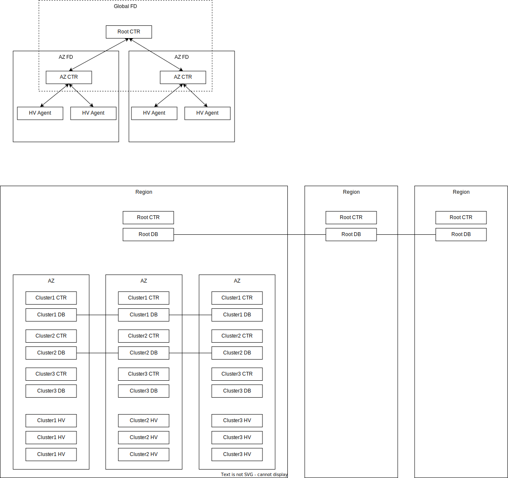

# IaaS

## IaaSの役割

- IaaSの役割は、Region、AZを選択して仮想リソースを提供することです
  - Region, AZともに3以上を提供します
- IaaSの上位レイヤーは、Region、AZを考慮してサービスを配置して、1AZが落ちても大丈夫なように、その重要度によっては1Regionが落ちても大丈夫なようにします

## IaaSのアーキテクチャ

- ユーザの利用想定
  - ユーザは、Region、AZを考慮してサービスを配置しますが、IaaSやプラットフォーム側である程度サポートすべきです
  - 例えばユーザは、VMグループを定義しどのように配置するかのポリシーを決めます
    - そのグループを選択してVMを起動すると、そのポリシーにしたがって、Region、AZ冗長するようにVMを配置するようなことを想定します
    - LBの設定もこのグループに対して行えることを想定します
- IaaSはグローバルでサービスを展開しますが、スケールアウトのため階層構造とします
  - AZごとにHVを束ねて管理するCTLのクラスタを用意し、そのクラスタ群をグローバルで管理するCTLを用意します

