# IaaS

## IaaSの役割

- IaaSは、Region、AZを選択して仮想リソースを提供することです
  - Region, AZともに3以上のAZを提供します
- IaaSの上位レイヤーは、Region、AZを考慮してサービスを配置して、1AZが落ちても大丈夫なように、その重要度によっては1Regionが落ちても大丈夫なようにします

## IaaSのアーキテクチャ

TODO