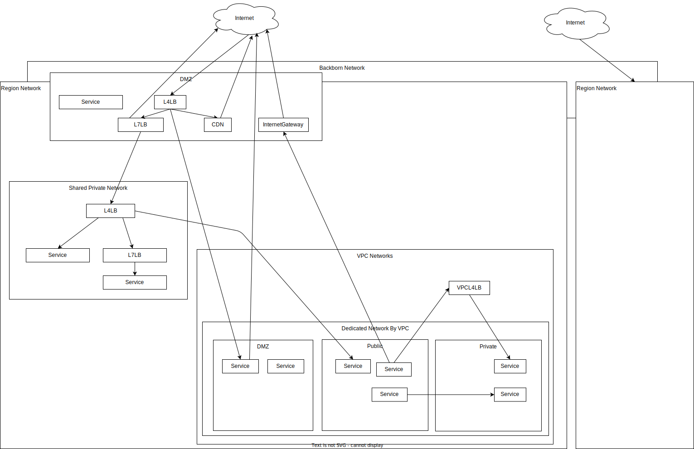

# IaaS

## IaaSの役割

- IaaSの役割は、Region、AZを選択して仮想リソースを提供することです
  - Region, AZともに3以上を提供します
- IaaSの上位レイヤーは、Region、AZを考慮してサービスを配置して、1AZが落ちても大丈夫なように、その重要度によっては1Regionが落ちても大丈夫なようにします

## IaaSのアーキテクチャ

- ユーザの利用想定
  - ユーザは、Region、AZを考慮してサービスを配置しますが、IaaSやプラットフォーム側である程度サポートすべきです
  - 例えばユーザは、VMグループを定義しどのように配置するかのポリシーを決めます
    - そのグループを選択してVMを起動すると、そのポリシーにしたがって、Region、AZ冗長するようにVMを配置するようなことを想定します
    - LBの設定もこのグループに対して行えることを想定します
- IaaSはグローバルでサービスを展開しますが、スケールアウトのため階層構造とします
  - AZごとにHVを束ねて管理するCTLのクラスタを用意し、そのクラスタ群をグローバルで管理するCTLを用意します

## Network

- Shared or Dedicated
  - Shared
    - アンダーレイのネットワーク機器や、それに近いノード(L4LBやVPCGWなどは)はSharedとする
    - Sharedレイヤーは帯域を余裕思った状態で土管運用できるようにする
    - Sharedレイヤーの通信は暗号化する必要はなく、その上のレイヤーで暗号化をするべき
  - Dedicated
    - 暗号化されない通信を扱う場合はDedicatedがMust
    - TLSを終端するようなL7LBは基本的にDedicatedにする
- ネットワーク分離
  - ネットワークは、その経路、および中間機器によるACLによって分離されます
  - SharedPublicNetwork (For VPC)
    - PublicIPで、インターネットからの通信を受けます
    - ACLは、そのサービスポートのみをACLで解放します
      - ACL例: src=any, dst=x.x.x.x/32, dst_port=443
  - SharedPrivateNetwork (For VPC)
    - PrivateIPで、社内からの通信を受けます
    - ACLは、そのサービスポートのみをACLで解放します
      - ACL例: src=any, dst=x.x.x.x/32, dst_port=443
      - ACL例: src=x.x.x.x/24, dst=x.x.x.x/32, dst_port=443