# CD

## デプロイ

- デプロイは設定ファイルとスクリプトを安全に配布し、スクリプトが実行できればよい
- ノード間の細かな順序制御はしなくてもデプロイが完了するのが望ましい
    - ノード間のデプロイの依存関係は極力なくすべき
- 設定ファイルの管理方法
    - 設定ファイルは、開発環境(VMコンテナ、dockerコンテナを想定)、k8sコンテナ上、物理環境上など様々な環境で配置され利用される
    - この設定ファイルを生成するためのテンプレートおよびテンプレートエンジンは各環境で共通化すべきである
- ファイルを安全に配布する方法
    - 設定ファイルのテンプレート情報やスクリプトは、RPMなどのパッケージとして配布し、ファイルの改ざん防止などはパッケージマネージャにまかせる
        - ここに秘密情報は含めず、誰にでも見られてよいようにする
    - 設定ファイルの種となるようなvalueファイルは、認証ができる暗号化された通信経路を利用する
        - SSH, MTLSなど
- デプロイツールはなにを使うべきか？
    - デプロイツールのタイプは大きく3つのタイプがある
        - セットアップ対象にSSHでファイルを配布して、スクリプトを実行するタイプ
            - ansibleなど
        - セットアップ対象に事前に秘密鍵を配布しておいて、セットアップ対象自信がその証明書をもってファイルを取得し、スクリプトを実行するタイプ
            - cincなど
            - ansible-pullでもできる？
        - k8s専用のデプロイツール
            - helmなど
    - アプリケーションごとの細かいデプロイのロジックをデプロイツールから分離し、デプロイツールはなんでもよいとするのが理想です
- デプロイツールの権限について
    - デプロイツールはどうしても強い権限を持つ必要があり、権限を正しく分割管理する必要があります

### デプロイ方法の提案

- アプリケーションのセットごとにセットアップのためのパッケージをRPMなどで用意します
    - イメージとしては、chefのcookbook、ansibleのplaybook、HelmのChartで、これをパッケージングします
    - 必ずアプリケーションセットごとにしてall in oneのような膨大なスクリプトは作らないようにしましょう
    - またアプリケーションセットごとに責任を持ってテストをし、品質を保つようにしましょう
- このアプリケーションセットパッケージをローカルにデプロイするためのツールを用意します(local deploy tool)
    - このツールには、cinc-soloを使ってもよいし、ansibleをlocalhost宛てで使うでもよいですし、他のツールでもよいです
- デプロイツールはローカルデプロイ用と、全体管理用で役割をわけて使い分けます
- このようにすることで、システム全体管理用にはdocker,cinc,ansibleなど様々な選択肢が取れて、管理側のデプロイロジックはローカルデプロイツールをキックするだけとシンプルになります
    - 開発環境のdockerにデプロイするならvalueをマウントしてlocal deploy toolをキックするだけです
    - k8sにデプロイするならvalueをconfigmapでマウントしてlocal deploy toolをキックするだけです
    - 物理環境にデプロイするならansibleやcincなどで、valueを置いてlocal deploy toolをキックするだけです

## CD

- デプロイは定期的に実施する必要があり、また障害などでサービスアウトされたノードはサービスイン前に最新の状態にデプロイする必要があります
- デプロイがどこまで実施されたか、成功したか、失敗したかを確認できるようにしましょう
- デプロイは自動的に、フェイラードメインを意識して、順番に正常性を確かめながら実施します